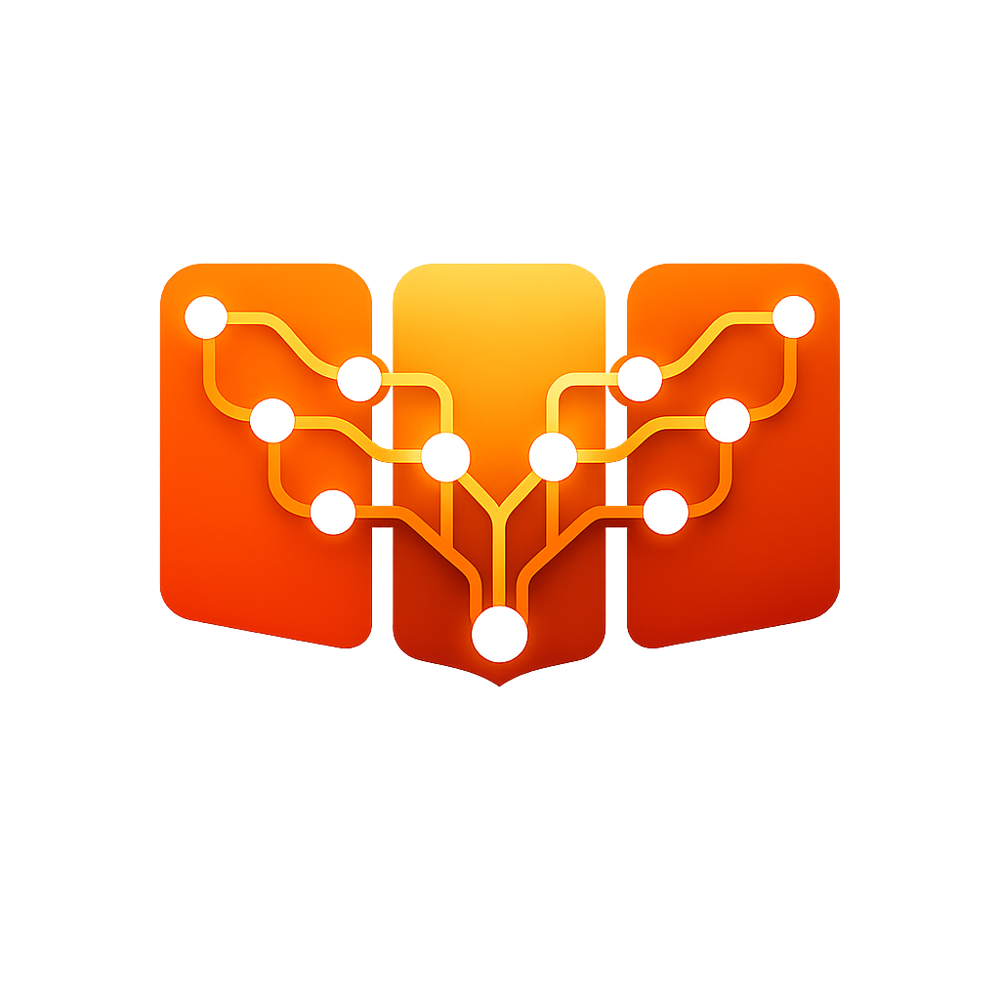

<p align="center">
  
</p>

<h1 align="center">AgentBoard</h1>

<p align="center">
  <strong>A Scrum / Kanban board where every teammate is an autonomous Claude agent.</strong><br/>
  Open the app, drop a goal in chat, watch a PM, CTO, designers, devs, DBA, and QA collaborate in real time — opening pull requests against your real GitHub repos.
</p>

<p align="center">
  <a href="LICENSE"></a>
  
  
</p>

---

## Why

Most "AI assistant" products give you one chat box. Real engineering work is a *team* problem — somebody plans, somebody designs, somebody codes, somebody breaks it on purpose. AgentBoard models that team:

- **8 agents by default** — PM, CTO, UI/UX, Language specialist, Frontend, Backend, DBA, QA — each a long-lived Claude Agent SDK session with its own persona file (`agents/<role>.md`), git worktree, and inbox.
- **They talk to each other** through a Redis-backed inbox/outbox. They create kanban tasks, hand off work, request reviews, ship commits.
- **They work on your real code** — connect a GitHub repo and they clone it, branch per task (`agent/<name>/task-<id>`), commit, push, and open a PR.
- **You stay in control** — every merge, release, or destructive command requires human approval. Cost caps stop runaway loops. Audit log is hash-chained.

It is not a chatbot. It is a small autonomous engineering organisation you can install with one command.

## What's in the box

| Surface | What it shows |
|---|---|
| **Home** (`/dashboard`) | Live ops summary — who's working, pending approvals, today's token usage, running previews |
| **Live** (`/live`) | Per-agent swimlanes + animated graph view of messages flying between nodes |
| **Board** (`/board`) | Kanban with drag-and-drop, tasks linked to GitHub branches and PRs |
| **Agents** (`/agents`) | Roster, status, persona editor, per-agent model + effort + budget controls |
| **Repos** (`/projects`) | Connected GitHub projects, drill-down with Pulls / Issues / Branches / Tasks |
| **Preview** (`/previews`) | Docker containers the team has shipped, with inline iframe |
| **Approvals** (`/approvals`) | Human gate for releases, breaking changes, anything sensitive |
| **Commits** (`/commits`) | All commits with diff viewer, grouped by day, filterable per agent |
| **Usage** (`/usage`) | Token usage per agent / model / day — same data Claude Code's `/usage` shows. In API-key mode it also shows USD. |
| **Timeline** (`/timeline`) | Wire feed of every event — thoughts, tool calls, commits, status changes |
| **Settings** (`/settings`) | GitHub auth, Slack/Discord webhooks, theme |

Power users:
- `⌘K` — global command palette (search agents/tasks/pages, jump anywhere)
- `⌘J` — open chat with the team

## Screenshots

<table>
  <tr>
    <td width="50%"><br/><sub>Mission control — who's working, pending approvals, today's usage</sub></td>
    <td width="50%"><br/><sub>Kanban — drag tasks across Backlog → Todo → In progress → Review → Done</sub></td>
  </tr>
  <tr>
    <td width="50%"><br/><sub>Previews — embedded iframes per running container, with mobile / tablet / desktop framing</sub></td>
    <td width="50%"><br/><sub>Usage — token-first, mirrors Claude Code's <code>/usage</code></sub></td>
  </tr>
  <tr>
    <td width="50%"><br/><sub>Rules — guardrails per agent, seeded with a template per role</sub></td>
    <td width="50%"><br/><sub>Live — per-agent swimlanes with messages flowing in real time</sub></td>
  </tr>
</table>

> Don't see images? They live in [`docs/screenshots/`](docs/screenshots/) — see the
> README there for how to regenerate them locally.

## Quick start

```bash
git clone https://github.com/matheusandrades/agentboard.git
cd agentboard
./setup.sh
```

The script:

1. Verifies Node 20+, Docker, and Docker Compose
2. Copies `.env.example → .env`
3. Installs dependencies via `pnpm` (auto-bootstrapped via `corepack`)
4. Brings up Postgres + Redis containers
5. Runs migrations and seeds 8 default agents
6. Starts the orchestrator and web under PM2
7. Detects `gh` CLI auth so GitHub integration "just works"

When it finishes, open **http://localhost:5173**.

### Authentication

AgentBoard supports two ways for the agents to talk to Anthropic:

| Mode | When to use |
|---|---|
| **Claude Code OAuth** (default) | You have `claude` (Claude Code CLI) installed and logged into a Pro/Max subscription. Zero extra cost. Just run, leave `ANTHROPIC_API_KEY` empty. |
| **Anthropic API key** | Server deploys, billing via console.anthropic.com. Add `ANTHROPIC_API_KEY=sk-ant-…` to `.env`. |

For GitHub:

| Mode | Setup |
|---|---|
| **`gh` CLI** (recommended) | `brew install gh && gh auth login` — supports SSO, GitHub Apps, fine-grained PATs. AgentBoard auto-detects. |
| **Personal Access Token** | Open `/settings` in the UI and paste a fine-grained PAT with `repo` scope. |

## Architecture

```
┌────────────────────────────────────────────────────────────────┐
│                          Web (Vite + React)                    │
│   Dashboard · Live · Board · Repos · Preview · Approvals · …   │
└──────────────────────────────▲─────────────────────────────────┘
                               │ REST + WebSocket
┌──────────────────────────────┴─────────────────────────────────┐
│                  Orchestrator (Fastify + TS)                   │
│                                                                │
│   ┌──────────────┐  ┌─────────────┐  ┌──────────────────────┐ │
│   │ Agent runner │  │ Dispatcher  │  │ MCP tool server      │ │
│   │ (SDK query)  │  │ (Streams)   │  │ send_message,        │ │
│   │              │  │             │  │ create_task, …       │ │
│   └──────┬───────┘  └──────┬──────┘  └──────────────────────┘ │
│          ▼                 ▼                                   │
│   ┌──────────┐      ┌─────────────┐    ┌─────────────────┐    │
│   │ Postgres │      │   Redis     │    │ Git worktrees / │    │
│   │ (state)  │      │ (queue+pub) │    │ Project clones  │    │
│   └──────────┘      └─────────────┘    └─────────────────┘    │
└────────────────────────────────────────────────────────────────┘
                               │
                               ▼
                    GitHub  ·  Docker  ·  Slack/Discord (webhooks)
```

See [`ARCHITECTURE.md`](ARCHITECTURE.md) for the full design rationale.

## How agents work

1. Each agent has a markdown persona at `agents/<role>.md`. The persona is its `systemPrompt`.
2. When a message lands in an agent's inbox (via the Redis dispatch stream), the orchestrator calls `query()` from the Claude Agent SDK with `resume: <sessionId>` so context survives across turns — agents are long-lived, not one-shot.
3. Agents have **custom MCP tools** wired in-process: `send_message`, `create_task`, `update_task`, `commit_code`, `launch_preview`, `open_pr`, `request_approval`, `record_decision`, `ask_agent`, `request_review`, `list_agents`, `read_inbox`, `stop_preview` — plus the standard Read/Edit/Write/Bash/Grep/Glob.
4. Hooks intercept every tool call (audit log + UI broadcast) and any `git push main` / `gh pr merge` / `npm publish` is **denied at the tool layer**. Releases are the human's call.
5. Cost is captured per turn from the SDK `result.usage` and priced via `apps/orchestrator/src/lib/pricing.ts`. Once the agent's daily cap is hit, the runner pauses it.

## Tools available to every agent

```
mcp__agentboard__send_message       → write to another agent's inbox
mcp__agentboard__read_inbox         → re-read recent messages
mcp__agentboard__create_task        → kanban card (auto-assigns to active sprint)
mcp__agentboard__update_task        → move column / reassign
mcp__agentboard__ask_agent          → threaded Q&A
mcp__agentboard__request_review     → bring QA in
mcp__agentboard__commit_code        → git add + git commit in worktree
mcp__agentboard__list_agents        → roster
mcp__agentboard__launch_preview     → docker compose up, returns URL
mcp__agentboard__stop_preview       → docker compose down
mcp__agentboard__request_approval   → escalate to the stakeholder (non-blocking)
mcp__agentboard__open_pr            → push branch + gh pr create
mcp__agentboard__record_decision    → write an ADR future agents can find
```

Plus the standard SDK toolkit (`Read`, `Edit`, `Write`, `Bash`, `Grep`, `Glob`).

## Stack

| Layer | Choice |
|---|---|
| Runtime | Node 20+, TypeScript ESM, pnpm workspaces |
| Backend | Fastify 5, Drizzle ORM, ioredis, pino |
| Frontend | Vite, React 18, Tailwind, @dnd-kit, Zustand |
| LLM | Claude Agent SDK (Opus 4.7 / Sonnet 4.6 / Haiku 4.5) |
| Storage | Postgres 16, Redis 7 |
| Infra | Docker Compose for local infra, PM2 for processes |
| Tests | Vitest |

## Common commands

```bash
# Daily ops
pnpm start             # boot orchestrator + web under PM2
pnpm logs              # tail logs
pnpm monit             # PM2 dashboard
pnpm restart           # reload both
pnpm stop              # shut down

# Database
pnpm db:migrate        # apply pending Drizzle migrations
pnpm db:seed           # seed 8 default agents + 1 demo sprint
pnpm db:reset          # truncate everything (keeps the agents)

# Infrastructure
pnpm infra:up          # docker compose up (postgres + redis)
pnpm infra:down        # stop containers
pnpm infra:logs        # tail container logs

# Quality
pnpm test              # vitest across all packages
pnpm typecheck         # tsc --noEmit
```

## Production deployment

For a self-hosted production install, use the `prod` Docker profile:

```bash
docker compose --profile prod up -d --build
```

This builds and runs orchestrator + web alongside Postgres and Redis. Set `ANTHROPIC_API_KEY` in your environment first; mount a host directory at `/workspace` if you want git worktrees to persist.

## Project layout

```
agentboard/
├─ agents/                Persona markdown files (one per role)
├─ apps/
│  ├─ orchestrator/       Backend service (Fastify + SDK)
│  └─ web/                Frontend (Vite + React)
├─ packages/
│  └─ shared/             Zod schemas + types shared between front and back
├─ workspace/             Per-agent git worktrees + project clones (gitignored)
├─ docker-compose.yml
├─ ecosystem.config.cjs   PM2 process definitions
├─ ARCHITECTURE.md
├─ CONTRIBUTING.md
├─ LICENSE
└─ setup.sh               One-shot installer
```

## Roadmap

Done in the current release:

- 8-agent default team with persona-based system prompts
- GitHub integration (clone, branch-per-task, `open_pr`)
- Docker preview per task with inline iframe viewer
- Per-agent model + effort + budget caps
- Usage view (token-first, plus USD when on API key) with daily/weekly/all-time totals
- Replay timeline with scrubber
- Hash-chained audit log
- Decision log + onboarding briefing
- Outbound webhooks (Slack/Discord/generic)
- Loop / merge / release guardrails
- Command palette (⌘K) and chat (⌘J)
- Mobile responsive layout

Ideas worth picking up next:

- Inline PR review (diff + comments without leaving the app)
- Codebase RAG so agents can answer "where is X defined" without re-reading the tree
- Auto-improve loop: distill PR review feedback back into the persona
- Project templates (SaaS starter, internal tool, mobile, etc) for first-run
- Native macOS / iOS notification bridge

## Contributing

PRs welcome. See [`CONTRIBUTING.md`](CONTRIBUTING.md) for the dev loop, code style, and how to add a new MCP tool or agent role.

## License

[MIT](LICENSE).
