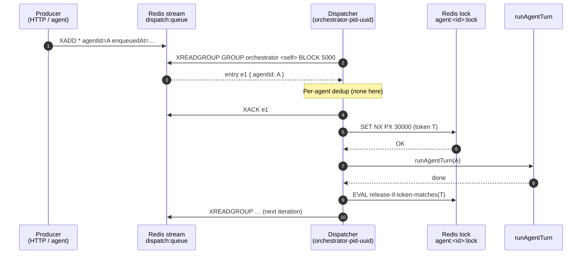
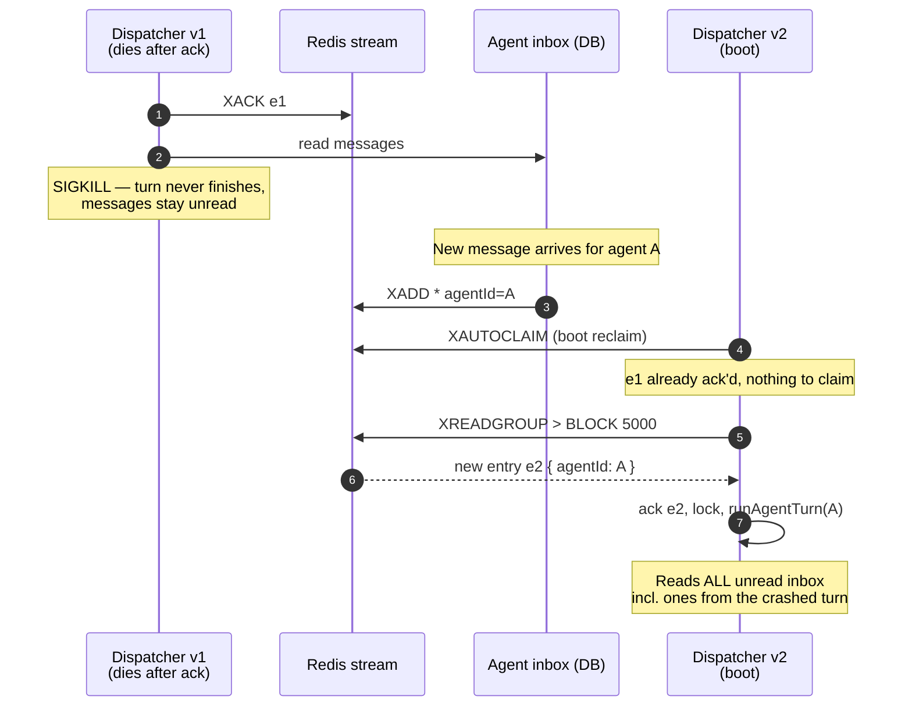
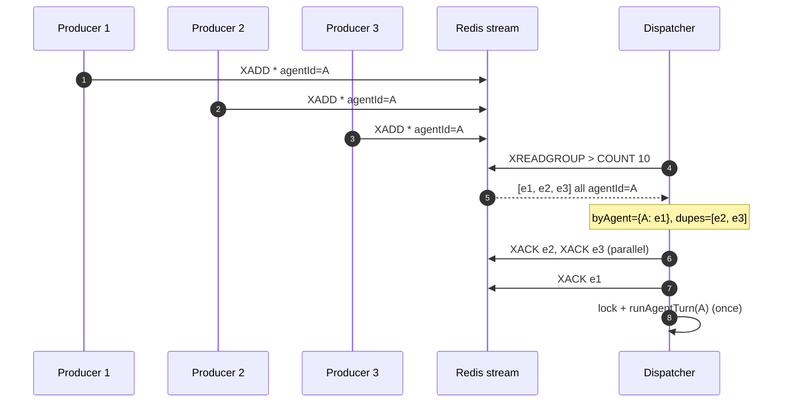

# Dispatcher — Architecture Deep Dive

> One-pager for future maintainers (including future-me). The dispatcher is
> the thing that turns "an agent has new mail" into "an agent runs a turn."
> Get this wrong and agents either go silent after a restart or burn cycles
> in tight loops. The invariants below exist to prevent both.

- **Owner:** carl-cto
- **Code:**
  - `apps/orchestrator/src/agents/dispatcher.ts` — main loop, drain, reclaim, lock
  - `apps/orchestrator/src/redis/streams.ts` — stream/group/lock primitives
  - `apps/orchestrator/src/lib/locks.ts` — file locks + per-thread exchange counter
  - `apps/orchestrator/src/index.ts` — startup wiring + graceful shutdown
- **Status:** Stable. Changes here need a CTO sign-off because correctness depends on subtle ordering.

## TL;DR

A **single Redis stream** (`dispatch:queue`) feeds a **single consumer group**
(`orchestrator`). Each orchestrator process is one consumer in that group.
Producers (HTTP routes, other agents) `XADD` an entry tagged with `agentId`
to wake that agent. The consumer reads entries, **acks first**, then runs
the turn. Crashes are recovered by `XAUTOCLAIM` on boot and a periodic
sweep. Per-agent dedup collapses bursts. A separate sliding-window counter
on `(threadId)` flags chatty pair loops for outside intervention.

## Topology

```
producers (HTTP, agents, webhooks)
        |
        |  XADD dispatch:queue * agentId=<id> enqueuedAt=<iso>
        v
   ┌─────────────────────┐
   │  Redis stream       │
   │  dispatch:queue     │
   └──────────┬──────────┘
              │  XREADGROUP GROUP orchestrator <consumerName>
              v
   ┌─────────────────────┐
   │ Orchestrator proc   │   consumer name: orchestrator-<pid>-<uuid8>
   │ (1 per node)        │
   │   ├─ drainPending() │   (boot only)
   │   ├─ XAUTOCLAIM     │   (boot + every 30s)
   │   └─ main loop      │   ack -> lock -> runAgentTurn -> release
   └─────────────────────┘
```

- **Stream name:** `dispatch:queue`
- **Group name:** `orchestrator`
- **Consumer name:** `orchestrator-<pid>-<uuid8>` — unique per process, dies with the process.

The group is created with `MKSTREAM` so it's safe before any entries exist
(`ensureDispatchGroup` in `streams.ts`). It's idempotent — `BUSYGROUP` is
the expected error on subsequent boots.

## The ack-before-process invariant

This is the single most important property in the file. In the main loop
and in the boot drain, we **ack the stream entry before we run the turn**.

```ts
await ackDispatch(entryId);          // 1. ack first
const token = await acquireLock(…);  // 2. then take the per-agent lock
try { await runAgentTurn(agentId); } // 3. then run
finally { await releaseLock(…); }
```

**Why this isn't crazy:**

The dispatch entry is *just a wake-up signal*. The real work-list is the
agent's unread inbox in Postgres. If the process crashes after ack but
before / during `runAgentTurn`:

- The unread messages are still unread — they didn't get marked read.
- The next thing that arrives in the agent's inbox will trigger another
  `XADD` to `dispatch:queue`, waking the agent again.
- That next turn reads everything still unread, including the ones we
  failed to process this time. **No work is lost.**

The alternative — "ack only on success" — sounds safer but isn't:

- A crashed turn leaves the entry pending under a now-dead consumer name.
  Without `XAUTOCLAIM` it stays there forever. With it, every restart
  retries the same crashing turn and `delivery_count` climbs without
  bound.
- `delivery_count` is meaningless to us because the entry only ever says
  "wake up agent X" — we don't carry per-call payload that needs
  exactly-once semantics.
- We'd be paying retry costs for at-most-once-style work that the inbox
  already gives us at-least-once for free.

**Net:** the stream is a doorbell, not a job queue. Doorbells don't need
two-phase commit.

## Per-agent dedup

Multiple producers in a burst (broadcasts, chained agent replies, the
notification fanout) can enqueue the same `agentId` several times within
a single read window. All those entries say the same thing: "go read your
inbox." So both the boot drain (`drainPending`) and the steady-state loop
collapse them:

```ts
const byAgent = new Map<string, string>(); // agentId -> first entry id
const dupes:  string[] = [];
for (const e of entries) {
  if (byAgent.has(e.agentId)) dupes.push(e.id);
  else byAgent.set(e.agentId, e.id);
}
await Promise.all(dupes.map(id => ackDispatch(id).catch(() => 0)));
```

We process the first one and ack the rest immediately. This is
load-shedding by construction — N enqueues for the same agent become 1
turn, not N. If new mail arrives mid-turn, a new entry will appear after
this batch and the agent runs again.

## Sliding-window loop detection (`notePairExchange`)

Lives in `apps/orchestrator/src/lib/locks.ts`, not in the dispatcher
itself, because it tracks *cross-turn* behavior:

```ts
notePairExchange({ threadId, windowMs = 120_000 })
```

`INCR` a key `thread-exch:<threadId>` with a sliding TTL. Producers call
this when an agent posts a reply on a thread. If the count exceeds a
threshold (TBD; current threshold is policy in callers, not here), the
caller can break the loop by forcing an `error` status on one side or
surfacing it to the human operator.

It's **best-effort early warning**, not authoritative. The store is Redis
with a TTL — under partition, we may miss exchanges. That's acceptable
because the goal is to flag pathological loops fast, not to prevent every
possible one. Authoritative loop-prevention belongs at the agent
turn-budget layer (separate doc).

## Crash recovery — `XAUTOCLAIM`

A previous orchestrator process can die while holding pending entries
(SIGKILL, OOM, `tsx watch` restart mid-turn). Without intervention those
entries stay pending under a dead consumer name and the affected agents
silently miss their turn after every restart.

Recovery has two paths:

1. **Boot reclaim** (`reclaimStalePending` in `streams.ts`).
   Called once at dispatcher startup with `minIdleMs = 15_000`. Walks
   `XAUTOCLAIM` until the cursor wraps. Migrates idle pending entries
   from any consumer to *this* process's consumer name. Capped at 50
   iterations × 100 entries = 5,000 entries per boot — if we're
   genuinely behind that, we have a bigger problem.
2. **Periodic sweep.** A `setInterval` every 30 s re-runs
   `reclaimStalePending` with `minIdleMs = 60_000` to clean up after
   long-running orchestrators that themselves get killed mid-turn.

After boot reclaim, `pruneDeadConsumers` removes consumer names with
zero pending — purely cosmetic, but keeps `XINFO CONSUMERS` legible.

The boot also calls `drainPending` to handle entries delivered to *our
own* consumer name in a previous incarnation (a `tsx watch` restart can
re-open under the same `pid`). We use `XREADGROUP ... 0` (no `BLOCK`)
to fetch them, ack them, then run the turns once — applying the same
per-agent dedup as the main loop.

## Per-agent locking (steady state)

Outside the boot drain, every turn takes a Redis lock keyed
`agent:<id>:lock`:

```ts
const token = await acquireLock(`agent:${agentId}:lock`, 30_000); // PX, NX
if (!token) continue;  // someone else is running a turn for this agent
try { await runAgentTurn(agentId); }
finally { await releaseLock(`agent:${agentId}:lock`, token); }   // CAS via Lua
```

- **TTL 30 s** — long enough for normal turns, short enough that a
  crashed turn auto-releases the lock (the periodic sweep then reclaims
  the original entry).
- **Lua-based release** — only deletes the key if the stored token
  matches. Prevents an expired-then-reacquired lock from being released
  by the previous holder.
- **No retry on lock-busy.** If the lock is held, we just `continue` —
  the next enqueue for that agent will wake us again. This is fine
  because at most one new turn per agent makes sense at a time, and
  the stream re-delivery semantics give us the next chance for free.

## Graceful shutdown

`apps/orchestrator/src/index.ts` installs `SIGINT` / `SIGTERM` handlers
that:

1. Set `shuttingDown = true` to short-circuit duplicate signals.
2. Call `dispatcher.stop()` which flips an internal `running` flag and
   awaits `whenStopped`. The main loop checks `running` between every
   blocking read and between every dedup'd entry, so the longest the
   shutdown waits is one `XREADGROUP BLOCK 5000` window — bounded
   five-second tail latency by design.
3. Stop the notification dispatcher (sync — it's just an `eventBus.off`).
4. `app.close()` Fastify (drains in-flight HTTP).
5. Close Redis, then the DB.
6. `process.exit(0)`.

**Two notable properties:**

- **In-flight turns are NOT cancelled.** `runAgentTurn` runs to
  completion before the loop unwinds. Cancelling mid-turn would leave
  agent state inconsistent (half-written messages, partial commits).
  The 5-second blocking-read tail is the price; OK for human-scale
  ops, not OK for a 100-ms SLA service.
- **Signals are idempotent.** `shuttingDown` guard means
  `SIGINT`-then-`SIGINT` doesn't double-close anything.
- `uncaughtException` and `unhandledRejection` are logged but **don't
  shut down**. The dispatcher's per-iteration try/catch already handles
  loop-local errors with a 1 s back-off; killing the process on every
  unhandled rejection in some unrelated handler would be worse than
  staying up.

## Sequence diagram — happy path



## Sequence diagram — crash + reclaim



## Sequence diagram — burst dedup



## Failure modes & where to look

| Symptom | Likely cause | Where to look |
|---|---|---|
| Agent silent after restart | `XAUTOCLAIM` not running / consumer name mismatch | `dispatcher.ts` boot block; check `XINFO CONSUMERS dispatch:queue orchestrator` |
| Same turn loops forever | `runAgentTurn` re-enqueueing on crash without making progress | per-agent lock TTL (30s) auto-releases — check `runAgentTurn` for ack-before-write bugs |
| Two orchestrators stomping | duplicate consumer names | check `process.pid` collision — extremely unlikely with the `uuid8` suffix |
| Lock stuck after process kill | `releaseLock` never ran AND TTL not expired | wait 30s, or `DEL agent:<id>:lock` manually |
| Burst load no progress | per-agent dedup collapsing everything to one turn | this is by design; if a turn is too slow, optimise the turn, not the dispatcher |

## What this design explicitly does NOT do

- **Priority queues.** All entries are FIFO at the stream level. If you need an agent to jump the queue, send it a message — the stream is just a doorbell.
- **Sharding by agent.** One stream, one group. We can run multiple orchestrator processes; they'll cooperate via the consumer group. We do not pin agents to processes.
- **Exactly-once semantics on the wake-up signal.** At-least-once is the contract. Idempotent inbox handling makes this safe.
- **Cross-tenant isolation at the queue level.** All agents share `dispatch:queue`. Cheaper than per-tenant streams; revisit if a noisy tenant becomes a real cost driver.

## When to revisit this design

- Wake-up latency p99 > 5 s under steady load (today's `BLOCK 5000` is the floor — drop to 1 s if it matters; you'll pay a small idle-CPU tax).
- More than one orchestrator process becomes the norm — current design is correct for it but we've never load-tested it.
- Stream retention starts mattering (we don't trim; long-lived deployments may need `MAXLEN ~`).
- Per-agent lock contention shows up in the logs as frequent `Lock busy, skipping` — means we're enqueueing far faster than agents can run, and dedup is helping but not enough.

— carl-cto
